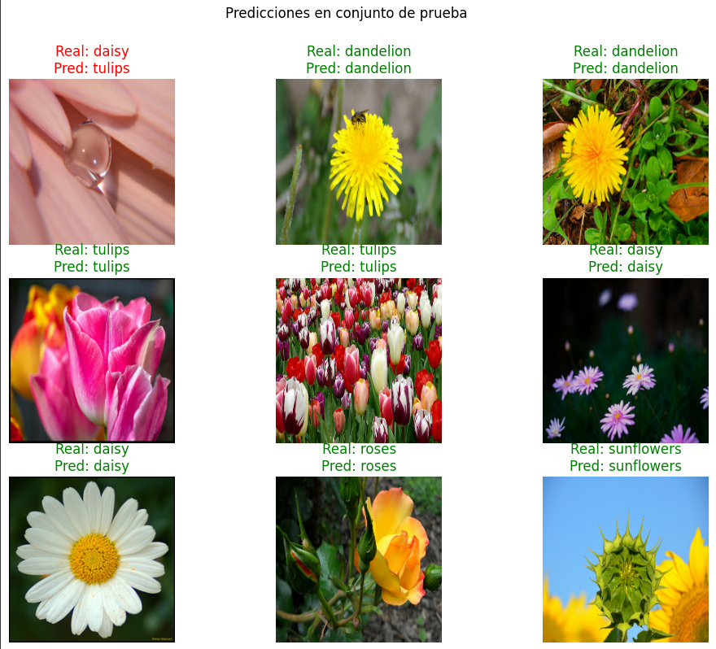
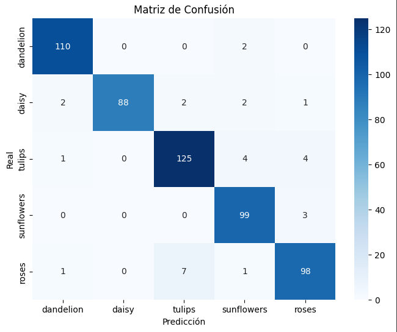
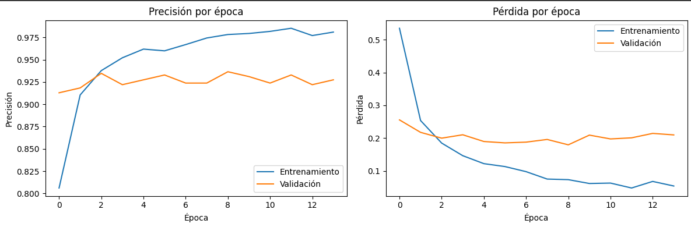

# 🌸 Clasificación de Flores con Transfer Learning

 <!-- Tú agregarás esta imagen -->
 <!-- Tú agregarás esta imagen -->

Este proyecto implementa un modelo de **clasificación de imágenes de flores** utilizando **transfer learning** con la arquitectura **EfficientNetB0** preentrenada en ImageNet. El objetivo es identificar correctamente cinco tipos de flores del dataset `tf_flowers` de TensorFlow Datasets.

---

## 🎯 Objetivo

Desarrollar un modelo de visión por computadora capaz de clasificar imágenes de flores con alta precisión, aprovechando modelos preentrenados y buenas prácticas de fine-tuning, incluso con un conjunto de datos relativamente pequeño (~3,600 imágenes).

---

## 🌼 Clases del dataset

El dataset `tf_flowers` contiene **5 categorías**:
- Diente de león (`dandelion`)
- Margarita (`daisy`)
- Tulipán (`tulips`)
- Girasol (`sunflowers`)
- Rosa (`roses`)

> ⚠️ El dataset presenta **desequilibrio de clases** (más imágenes de girasoles que de tulipanes, por ejemplo).

---

## 🛠️ Tecnologías utilizadas

- **Lenguaje**: Python 3.12
- **Framework**: TensorFlow 2.19 + Keras
- **Librerías**:
  - `tensorflow_datasets` (para cargar el dataset)
  - `matplotlib` y `seaborn` (visualización)
  - `scikit-learn` (métricas: matriz de confusión, reporte de clasificación)
  - `numpy`

---

## 📂 Estructura del código

1. **Verificación del entorno**  
   Se confirma la versión de Python, TensorFlow y la disponibilidad de GPU.

2. **Carga del dataset**  
   Se utiliza `tfds.load('tf_flowers')` para dividir los datos en:
   - 70% entrenamiento
   - 15% validación
   - 15% prueba

3. **Preprocesamiento**  
   - Redimensión de imágenes a **224×224 píxeles** (entrada requerida por EfficientNetB0)
   - Conversión a `float32`
   - No se normaliza manualmente (EfficientNet incluye su propio preprocesamiento)
   - Configuración de rendimiento: `cache()`, `shuffle()`, `batch()`, `prefetch()`

4. **Modelo con Transfer Learning**
   - Se carga **EfficientNetB0** preentrenado en ImageNet (`weights='imagenet'`)
   - Se congela el modelo base (`base_model.trainable = False`)
   - Se añaden capas personalizadas:
     - `GlobalAveragePooling2D()`
     - `Dropout(0.3)`
     - `Dense(128, activation='relu')`
     - `Dropout(0.2)`
     - `Dense(5, activation='softmax')` (una neurona por clase)

5. **Entrenamiento**
   - Optimizador: `Adam` con `learning_rate=0.001`
   - Función de pérdida: `sparse_categorical_crossentropy`
   - Métrica: `accuracy`
   - Callback: `EarlyStopping` (detiene si no mejora la pérdida en validación durante 5 épocas)

6. **Evaluación**
   - Precisión en conjunto de prueba: **94.55%**
   - Visualización de:
     - Curvas de entrenamiento vs validación (precisión y pérdida)
     - Ejemplos de predicciones (correctas e incorrectas)
     - Matriz de confusión
     - Reporte de clasificación (precisión, recall, F1-score por clase)

---

## 📈 Resultados clave

- **Precisión final en prueba**: **94.55%**
- El modelo aprende rápidamente (más del 90% de precisión desde la época 2)
- Algunos errores ocurren entre clases visualmente similares (ej: margarita vs tulipán)

> 📌 **Tú puedes insertar aquí una imagen de las curvas de entrenamiento**  
> 

---

## 🔍 Análisis crítico

### ¿Por qué se eligió EfficientNetB0?
- Excelente relación **precisión/eficiencia**
- Menos parámetros que ResNet50 → menor riesgo de sobreajuste en datasets pequeños
- Preentrenado en ImageNet → transferencia de conocimiento visual robusta

### Principales desafíos
1. **Desequilibrio de clases**: Algunas flores tienen muchas más muestras.
2. **Variabilidad visual**: Fondos no controlados, iluminación y ángulos diversos.
3. **Tamaño limitado del dataset**: Solo ~3,600 imágenes en total.

### Mejoras propuestas para producción
- ✅ **Aumento de datos**: rotación, zoom, volteo horizontal.
- ✅ **Fine-tuning**: descongelar las últimas capas de EfficientNetB0 y reentrenar con LR bajo (ej. `1e-5`).
- ✅ **Balanceo de clases**: usar `class_weight='balanced'` en `model.fit()`.
- ✅ **Exportar a TensorFlow Lite**: para despliegue en dispositivos móviles.
- ✅ **Monitoreo continuo**: registrar métricas en producción y reentrenar con nuevos datos.

---

## ▶️ Cómo ejecutar el proyecto

1. Clona este repositorio:
   ```bash
   git clone https://github.com/EnzoGatica/clasificacion-flores.git
   cd clasificacion-flores